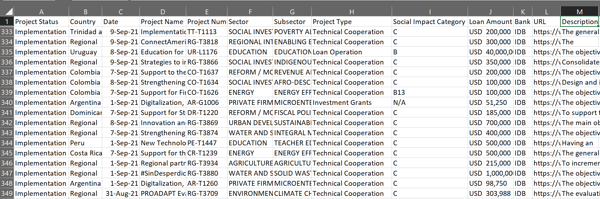

## __Conceptualizing Development - from Projects in Inter-American Development Bank (IDB)__

### __Introduction__

The development indicates a specified state of growth or advancement, which is a wide-recognized medium of social processes, social transition, and social interaction. In terms of the space factor, it can scale from a region, a country, or even across multiple nations, providing a high level to fine-grained research targets. As to the time scale, it can also demonstrate from a short to long to an enormous period of social process. However, to efficiently and effectively measure its abstraction and identify its transformation is not always straightforward. International financial institutions (IFI) facilitate the socio-economic construction of regions and subregions, and provide international cooperation mechanisms in managing the global financial system. Therefore, an appropriate development bank can elaborate the socio-economic process among its member countries and across its established timespan.
    
Inter-American Development Bank (IDB) is one of the representatives of IFI. Established in 1959, it has been providing financing and professional advice to enhance a country's development. Their work focuses on improving lives in Latin America and the Caribbean, and the improvements include reducing poverty and inequality, enhancing health and education, advancing infrastructure, etc. According to IADB's acknowledgment, they dedicate to "prioritizes social inclusion and equality; productivity and innovation; and regional economic integration in its development work, ..., addresses the cross-cutting issues of gender equality and diversity; climate change and environmental sustainability; and institutional capacity and the rule of law"(*). Through their financial and technical projects to affiliated countries, we can plot and frame the social processes in development, especially in the societal and economic fields. The first project was granted in 1960, which provides over 60 years scale in time; furthermore, they consist of 48 member countries, which crosses a broad space factor for social development. Hence, analyzing the project data from IDB can construct a framework for development and conceptualize its abstraction.

(*) https://www.iadb.org/en/about-us/overview

### __Method and Data__
Here is a sample of project page https://www.iadb.org/en/projects-search?country=&sector=&status=&query=&page=0 and project detail https://www.iadb.org/en/project/AR-L1336. In the archive, I scraped columns including *Project Status, Country, Date, Project Name, Project Number, Sector, Subsector, Project Type, Social Impact Category, Loan Amount, Bank, URL, Description*.

For more detailed implementation, please see the code in the python file. The outline of my process is to use *requests* to send out the request and collect data, *BeautifulSoup* to reformat the information from the HTML format, and employ parallel computing to speed up the scraping. Noticeably, the database is relatively large, containing over 20,000 records, so I leverage *random* and *user-agent* to mimic human behaviors and prevent being restricted from the website. Here is a screenshot of the collected archive.

### __Evaluation__

In order to render meaningful and reasonable outcomes from the archive, the appropriateness of an archive needs to match the investigated social process. (Note: although the motivation from the mini-project starts from the development of the human society, the country and region I describe hereafter should only be in Latin America and the Caribbean since the data is retrieved from IDB). The archive contains almost all meaningful information from the IDB website, as shown in the columns, which allows me to investigate the development from different perspectives. For instance, by looking into the country and date columns, I can retrieve the social transition of development between countries, a developed country nowadays might have been underdeveloped and received lots of loans and aids, and vice versa. Besides, I can also examine the transition speed and scale within one particular country, for example, a country that used to receive frequent assistance from projects may indicate its improvement in development. By zooming into the sector and subsector columns, I can extract the change of development types. That is, there could be a majority of projects in transportation infrastructure in the 1970s, but sustainable energy after the 2010s. Being able to spot this transition is helpful for researchers to unfold the social process at the time. The project type can also provide the preference of development assistance and how it has changed over time, from monetary to technical support. The column of social impact category can illustrate the impacts people care about more in different eras. And the amount of loan can be an indicator of the economic flow in a country at a timeframe. Finally, the description contains sufficient text data, which provides more broad and potential applications to understand the social processes of development [[1]](#1).      
    
The time resolution will be the main limitation for this archive. Considering that the first project started in 1960, the archive only offers a 60-year timespan to decompose the social and economic development. Development usually can be with a long time-magnitude, and sometimes we may need a long period to spot the socio-economic significance of the development. It can be over a hundred years, or even zoom out to 10,000 years for the development of human beings, depending on the research interests. However, these analyses obviously go beyond the timescale of the archive. Therefore, for a short timescale analysis, e.g. the socio-economic development of Argentina after WWII, this archive can provide useful information, while it cannot be reasonable and informative for a long timespan study [[2]](#2). Although the development banks are a relatively innovative and short concept for the human world, they tend to contain abundant records for a country's transition in finance and society, rendering them still a representative research target.
    
This archive can be deemed digitized and born-digital data. At an early age (e.g. 1960), the data was transformed from the project paperwork; therefore, the early data relied on the documentation and records and might contain transformation errors. Also, IDB truncated only partial information from the documentation, allowing people to only gather parts of the key factors instead of the whole picture. For more recent data, even though they directly construct the data in a digital way, it still only demonstrates the key factors, offering no further detail for researchers to leverage [[3]](#3). Hence, if a research design needs to dive deeply into the textual data from the documents, this archive may not be suitable in this case.
    
The timestamp in the archive is relatively continuous; nonetheless, the gaps do show in some columns. First of all, the date columns equal the approved date, meaning that the pending or under-reviewing projects have no date. Furthermore, there is no date information for the project being initiated. That is, If people are interested in the project filing date, the archive cannot answer the request. Also, the archive cannot tell us how long it takes for a project to be approved, to finish, and if the development time of projects sees any transition. Another deficit of the archive is missing data, some projects showcase on the overview page, while if I click on the detail link, it contains no more information. The loss can happen to the whole page, while sometimes it also happens to several rows only. The information loss is a potential gap for people to capture the development of a country or even the whole of Latin America, which can cause a "blank" in the analysis, or even worse, a deviation from the real trajectory of the development. Finally, some projects do not have a description (lack of text data), providing no chance for people to employ content analysis and gain more fine-grained detail [[4]](#4). All of the insufficiency of the archive should be kept in mind when working with it.

Finally, let us review if there exist ethical concerns in the archive. Even though the projects can more or less affect the local people and communities, such as human rights and the environment, the archive itself does not directly relate to individual humans or groups. Therefore, it does not have ethical implications from current applications [[5]](#5).

### __Reference__

<a name="1">[1]</a> Brügger, N. (2018). *The Archived Web: Doing History in the Digital Age.* Ch1-3; Rogers, R. (2019). *Periodizing Web Archiving: Biographical, Event-Based, National and Autobiographical Traditions.*

<a name="2">[2]</a> Gaddis, J. L. (2002). *The Landscape of History:How Historians Map the Past: How Historians Map the Past.* Ch2, 3; Bailey, G. (2007). Time perspectives, palimpsests and the archaeology of time. *Journal of Anthropological Archaeology, 26*(2), 198–223. doi:10.1016/j.jaa.2006.08.002

<a name="3">[3]</a> Gaddis, J. L. (2002). *The Landscape of History:How Historians Map the Past: How Historians Map the Past.* Ch2, 3

<a name="4">[4]</a> Ben-David, A., & Amram, A. (2019). Computational methods for web history. In N. Brugger, & I. Milligan (Eds.), *The SAGE handbook of web history.* Sage UK.

<a name="5">[5]</a> Lomborg, S. (2019). Ethical considerations for web archives and web history research. In N. Brugger, & I. Milligan (Eds.), *The SAGE handbook of web history.* Sage UK.
